# 浅谈React表单组件的封装

> 在中后台业务前端开发的工作当中，表单的开发相对最多最频繁的，随着业务越来越复杂，表单变的越来复杂变的不可移植复用。在软件设计中通常用耦合度和内聚度作为衡量模块独立程度的标准。从前端组件粒度来看，高内聚：尽可能每个组件只完成一件事（最大限度的聚合）； 低耦合：减少对其他模块的依赖，使模块的可重用性、移植性大大增强。

## 分类

### 应用场景

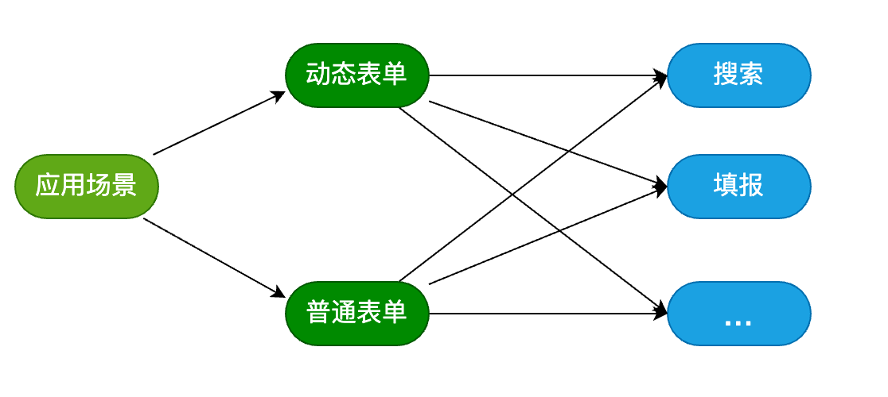

> 从上面这张图可以看出动态表单和普通的表单都可能会应用到不同的场景中去，那我们在封装的时候只需要实现动态表单和普通表单，不去对场景做限制来提高表单的可复用性和移植性

### 功能

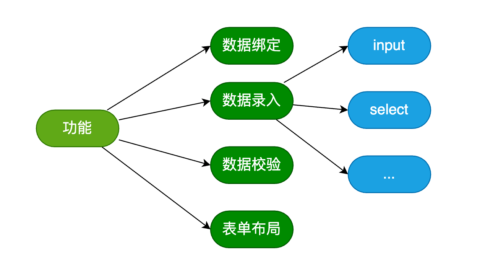

> 从上面这张图可以看出数据录入用到的组件也是个种各样的。既然数据录入的组件是不固定的，我们在封装表单的时候从我们表单组件中给剔除出去。我们只要提供相应的API 相应的开发在开发的时候选择录入组件或者实现自定义的录入组件。最大程度的解藕来提高表单的可复用性

## React表单的实现 [@hanyk/general-form]()

### Form

* 定义context

> 我们希望可以通过在Form 可以透传一些属性给每个FormIten 这时候就需要用到Conetext

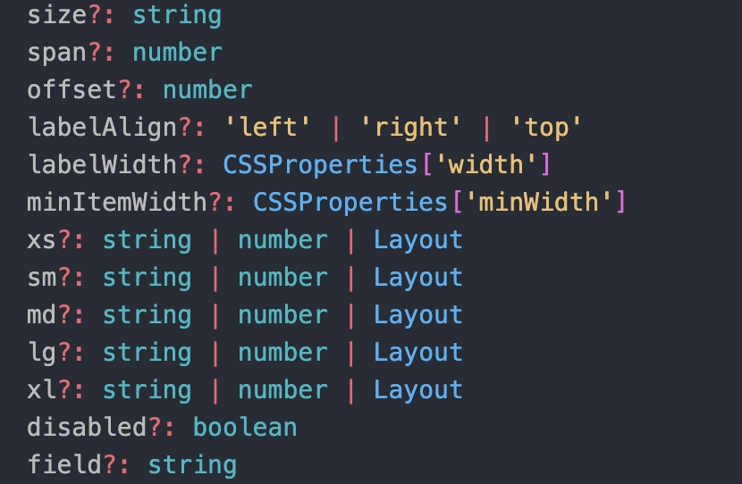

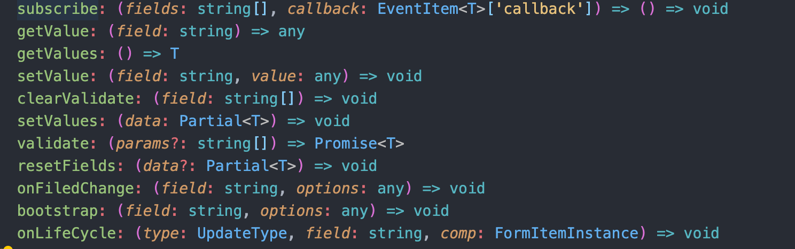

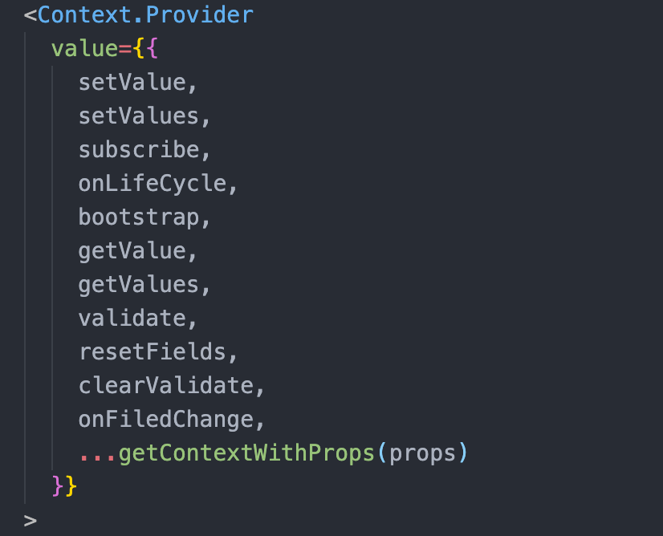

* form的子组件既可以是通过jsonschem生成也可以是react组件

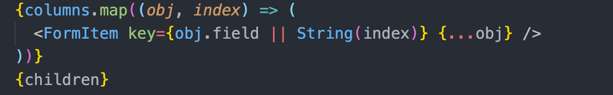

> 我们希望数据的更新能够最小粒度在每个FormItem内部实现数据的更新，每个FormItem的数据变化不会引起整个form的重新渲染

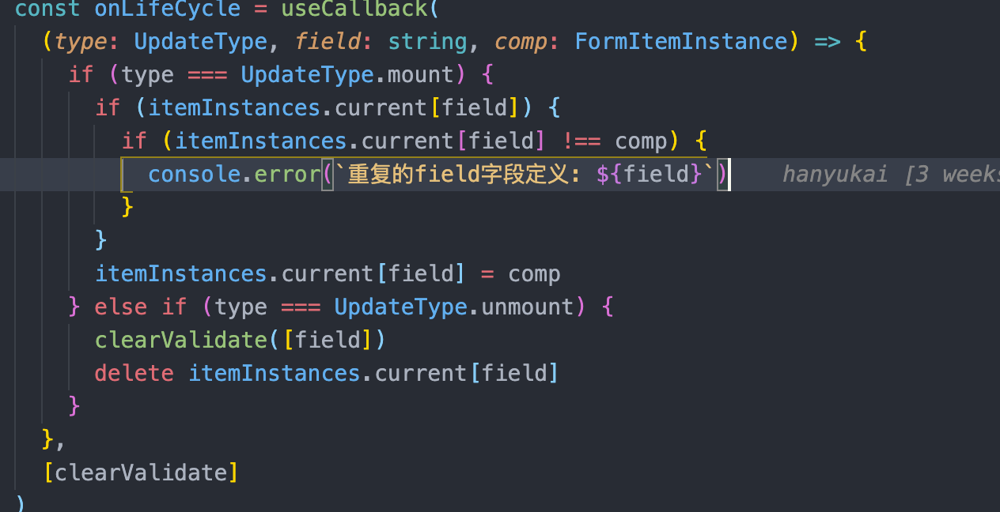

> 提供注册录入组件的方法

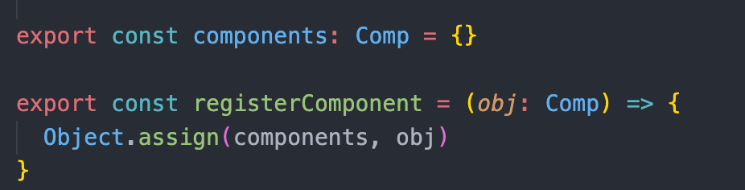

### FormItem

> formItem实现了布局以及一些表单验证信息的收集

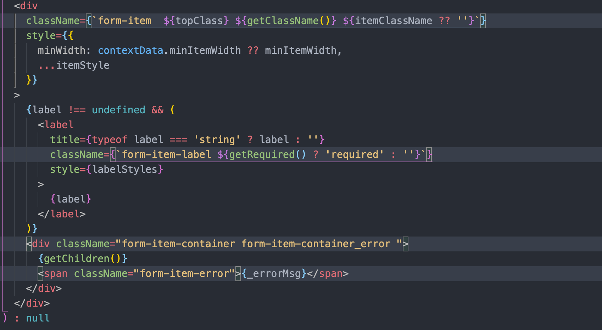

> formItem每次绑定的字段变更都会通知form重新收集当前formItem

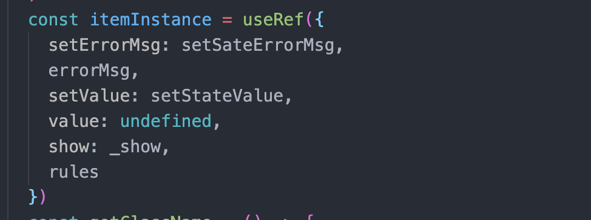

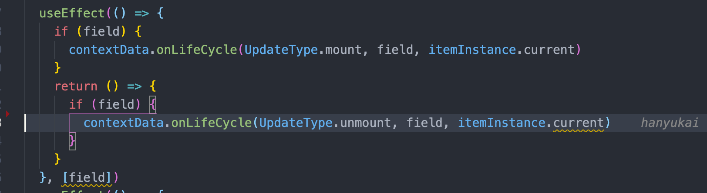

> 对于子组件的实现

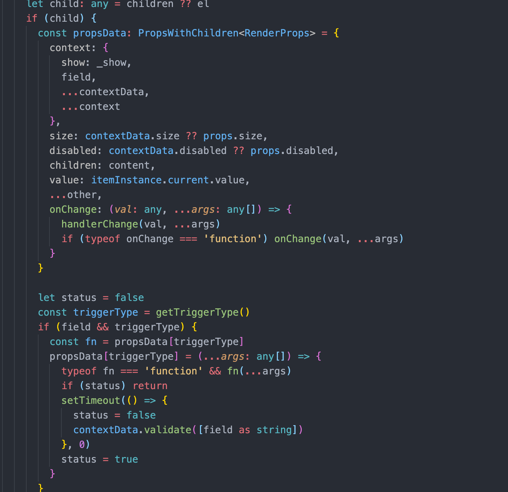

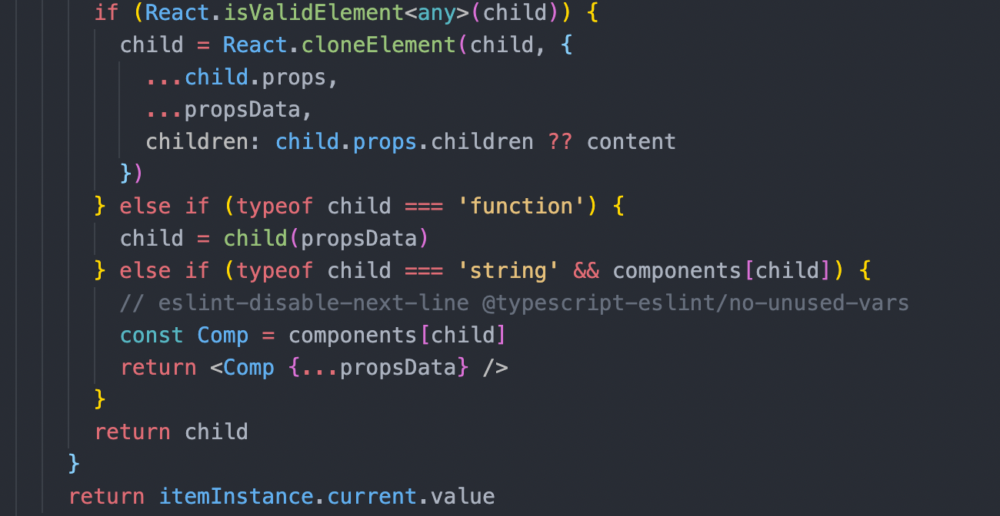

### subscribeFields

> subscribeFields 订阅字段变更的高阶组件

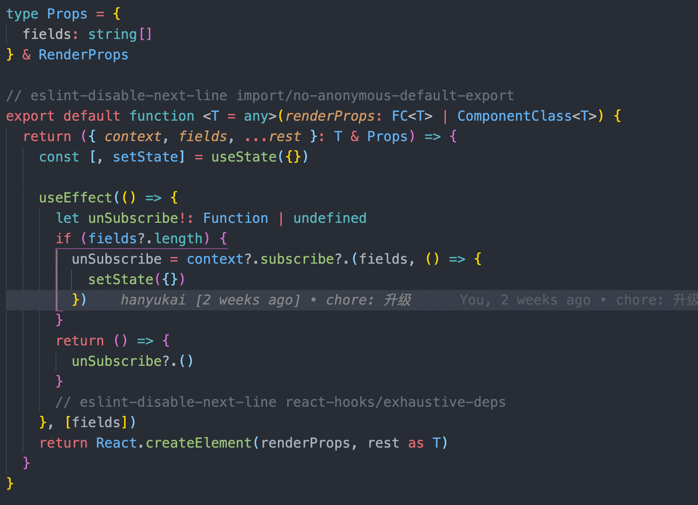

### withDynamicData

> withDynamicData 根据动态参数获取数据的高阶组件

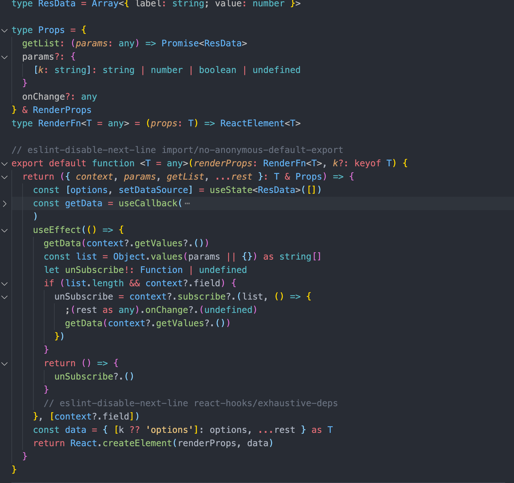
